# Analisis COVID-19: Bivariate dan Prediksi

Proyek ini melakukan analisis bivariate antara variabel COVID-19 untuk Indonesia dan United Kingdom, serta implementasi model prediksi sederhana menggunakan Linear Regression dan Random Forest.

## Data
- `covid.csv`: Dataset COVID-19 dari OWID (Our World in Data)

## Analisis Bivariate

### Perbandingan Kasus Baru Indonesia vs UK
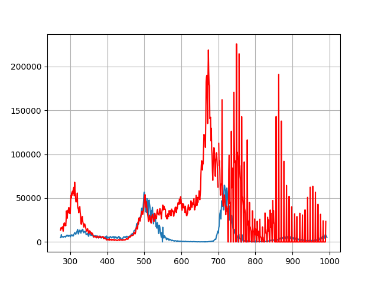
Grafik ini menunjukkan perbandingan jumlah kasus baru harian antara Indonesia (biru) dan United Kingdom (merah) selama 720 hari terakhir.

### Scatter Plot dengan Pewarnaan Waktu
Grafik scatter plot berikut menggunakan colormap 'plasma' untuk menunjukkan evolusi hubungan dari waktu ke waktu (dari ungu tua ke kuning terang).

#### Indonesia: Kasus Baru vs Kematian Baru
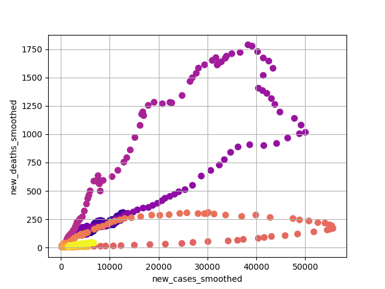
Hubungan antara jumlah kasus baru dan kematian baru di Indonesia.

#### UK: Kasus Baru vs Kematian Baru
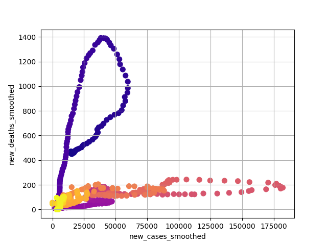
Hubungan antara jumlah kasus baru dan kematian baru di United Kingdom.

#### Indonesia: Indeks Ketat Kebijakan vs Kematian
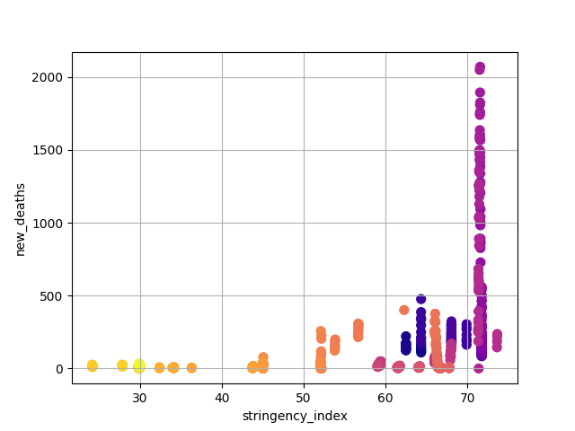
Hubungan antara indeks ketat kebijakan pemerintah dan jumlah kematian di Indonesia.

#### UK: Indeks Ketat Kebijakan vs Kematian
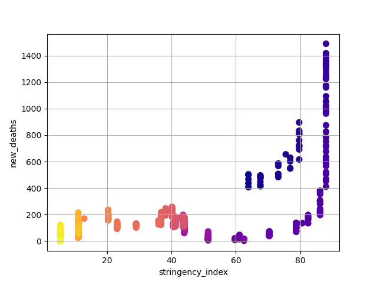
Hubungan antara indeks ketat kebijakan pemerintah dan jumlah kematian di United Kingdom.

#### Indonesia: Indeks Ketat Kebijakan vs Kasus Baru
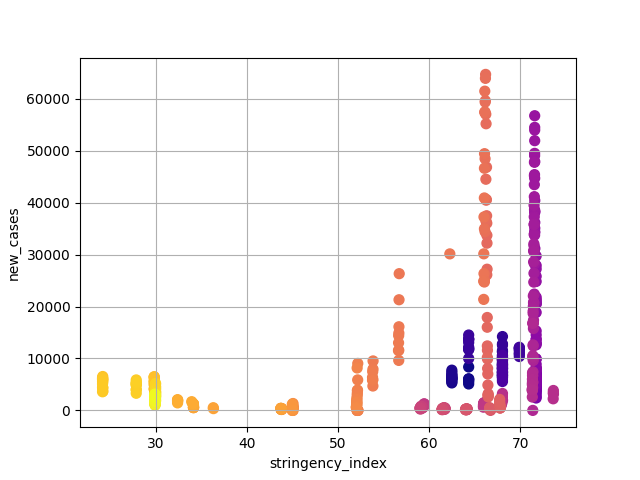
Hubungan antara indeks ketat kebijakan dan jumlah kasus baru di Indonesia.

#### UK: Indeks Ketat Kebijakan vs Kasus Baru
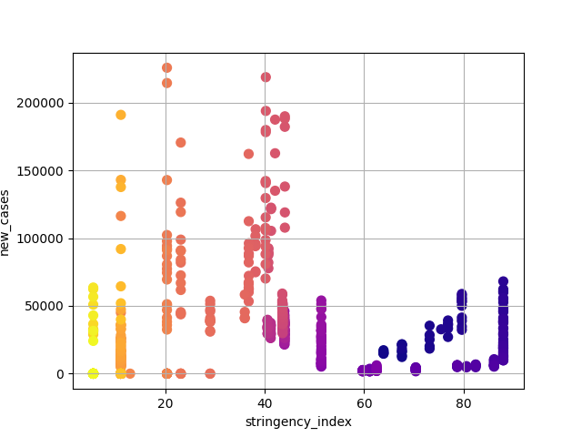
Hubungan antara indeks ketat kebijakan dan jumlah kasus baru di United Kingdom.

#### Indonesia: Indeks Ketat vs Reproduction Rate
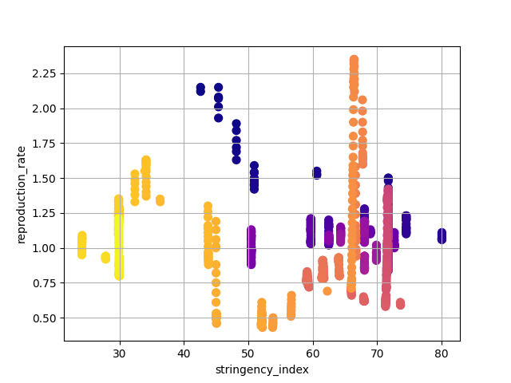
Hubungan antara kebijakan ketat dan reproduction rate di Indonesia.

#### South Korea: Indeks Ketat vs Reproduction Rate
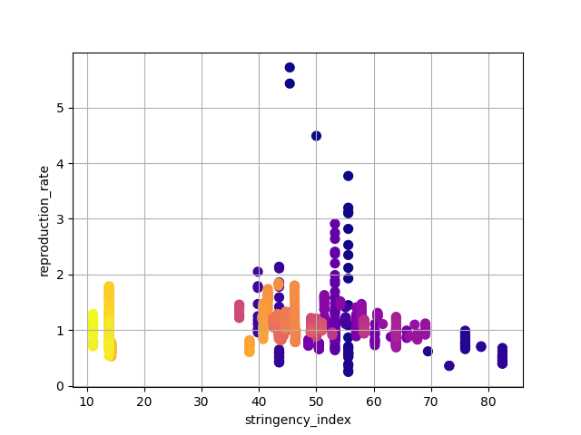
Hubungan antara kebijakan ketat dan reproduction rate di South Korea.

#### Indonesia: Vaksinasi vs Reproduction Rate
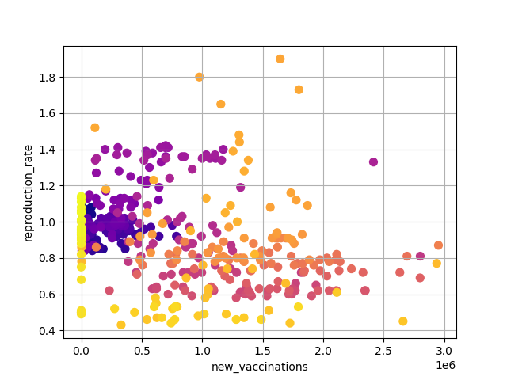
Hubungan antara jumlah vaksinasi harian dan reproduction rate di Indonesia.

#### South Korea: Vaksinasi vs Reproduction Rate
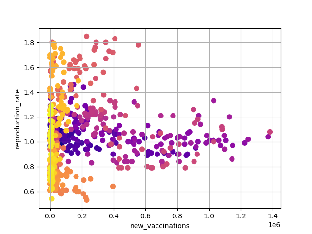
Hubungan antara jumlah vaksinasi harian dan reproduction rate di South Korea.

#### Indonesia: Vaksinasi vs Kematian
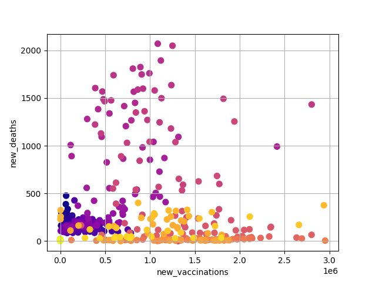
Hubungan antara jumlah vaksinasi harian dan kematian di Indonesia.

#### UK: Vaksinasi vs Kematian
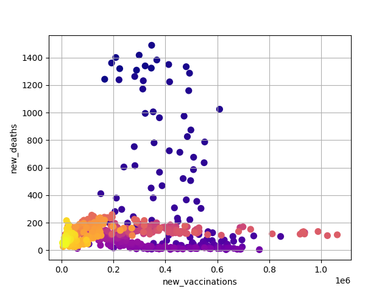
Hubungan antara jumlah vaksinasi harian dan kematian di United Kingdom.

## Prediksi

### Prediksi Kematian dari Kasus (Linear Regression)
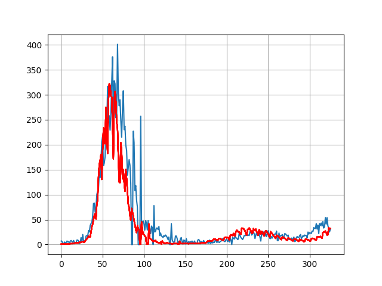
Grafik menunjukkan prediksi kematian menggunakan Linear Regression dari data kasus baru. Garis biru adalah data aktual, garis merah adalah prediksi.

### Prediksi Kasus dari Kebijakan (Linear Regression)
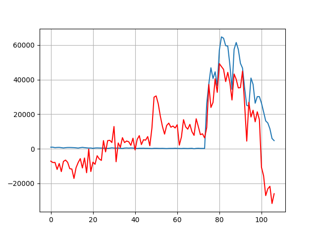
Prediksi jumlah kasus baru dari variabel kebijakan (stringency_index, new_vaccinations, new_tests) menggunakan Linear Regression.

### Prediksi Kasus dari Kebijakan (Random Forest)
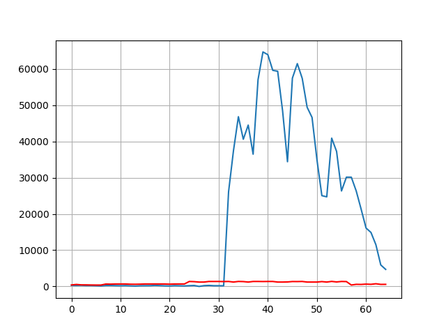
Prediksi jumlah kasus baru menggunakan Random Forest dengan parameter n_estimators=100, max_depth=5.

## Hasil Prediksi

### Linear Regression untuk Kematian dari Kasus:
- R² Score: -28.83 (buruk, menunjukkan model tidak cocok untuk data ini)
- Koefisien: 0.033
- Intercept: 4.316

### Linear Regression untuk Kasus dari Kebijakan:
- R² Score: 0.421
- Koefisien: [2425.99, -0.068, 0.197]
- Intercept: -173258.69

### Random Forest untuk Kasus dari Kebijakan:
- R² Score: -0.652 (buruk, mungkin overfitting atau data tidak cukup)

## Kesimpulan
Analisis bivariate menunjukkan pola evolusi hubungan antara variabel COVID-19 dari waktu ke waktu. Model prediksi sederhana memberikan hasil yang bervariasi, dengan performa terbaik pada prediksi kasus dari kebijakan menggunakan Linear Regression.

## File Utama
- `covid_analysis.py`: Script analisis dan prediksi
- Berbagai file PNG untuk grafik hasil analisis

## Cara Menjalankan
```bash
python3 covid_analysis.py
```

Script akan menghasilkan grafik dan output prediksi di terminal.