# Analisis COVID-19: Bivariate dan Prediksi

Proyek ini melakukan analisis bivariate antara variabel COVID-19 untuk Indonesia dan United Kingdom, serta implementasi model prediksi sederhana menggunakan Linear Regression dan Random Forest.

## Data
- `covid.csv`: Dataset COVID-19 dari OWID (Our World in Data)

## Analisis Bivariate

### Perbandingan Kasus Baru Indonesia vs UK

Grafik ini menunjukkan perbandingan jumlah kasus baru harian antara Indonesia (biru) dan United Kingdom (merah) selama 720 hari terakhir.

### Scatter Plot dengan Pewarnaan Waktu
Grafik scatter plot berikut menggunakan colormap 'plasma' untuk menunjukkan evolusi hubungan dari waktu ke waktu (dari ungu tua ke kuning terang) menggunakan variabel baru:
- reproduction_rate
- new_cases_smoothed_per_million
- people_fully_vaccinated_per_hundred
- weekly_hosp_admissions_per_million

#### Indonesia: Reproduction Rate vs Kasus per Juta

Hubungan antara reproduction rate dan kasus baru per juta penduduk di Indonesia.

#### UK: Reproduction Rate vs Kasus per Juta
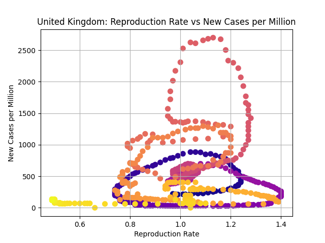
Hubungan antara reproduction rate dan kasus baru per juta penduduk di United Kingdom.

#### Indonesia: Reproduction Rate vs Vaksinasi
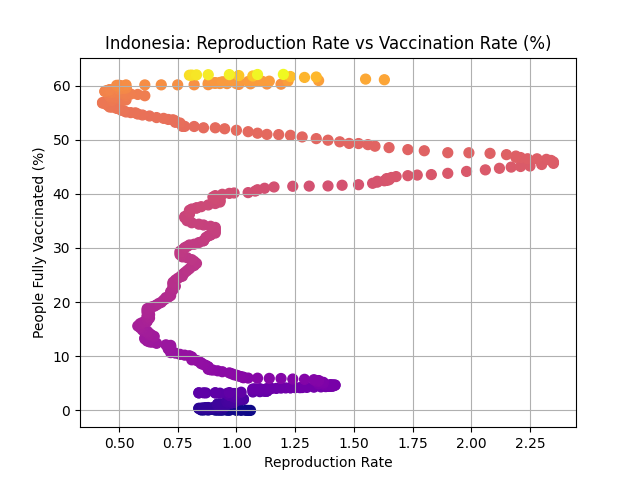
Hubungan antara reproduction rate dan persentase populasi yang divaksinasi penuh di Indonesia.

#### UK: Reproduction Rate vs Vaksinasi

Hubungan antara reproduction rate dan persentase populasi yang divaksinasi penuh di United Kingdom.

#### Indonesia: Kasus per Juta vs Vaksinasi
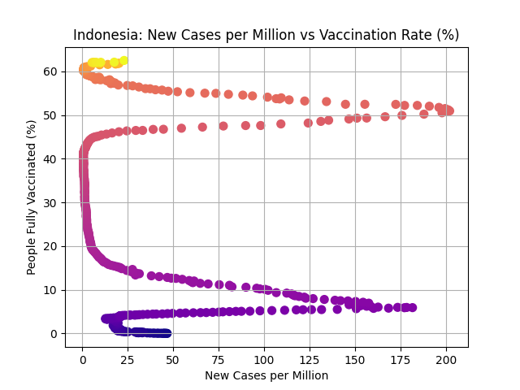
Hubungan antara kasus baru per juta dan persentase vaksinasi penuh di Indonesia.

#### UK: Kasus per Juta vs Vaksinasi
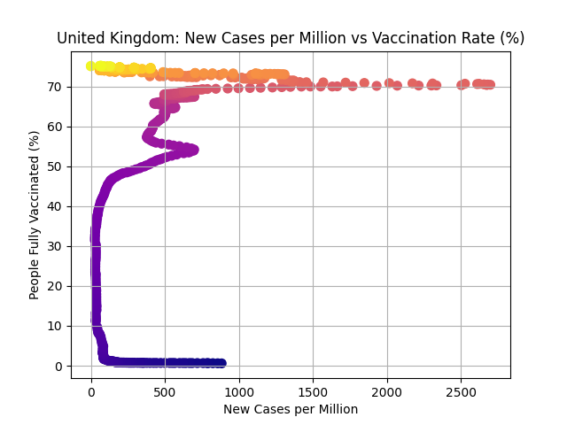
Hubungan antara kasus baru per juta dan persentase vaksinasi penuh di United Kingdom.

#### Indonesia: Reproduction Rate vs Hospitalisasi
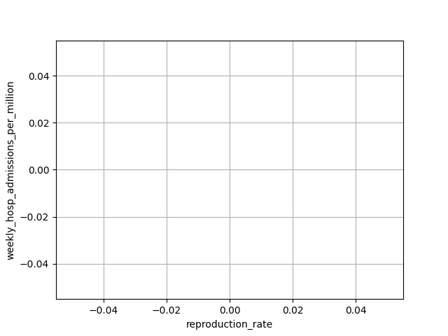
Hubungan antara reproduction rate dan rawat inap mingguan per juta di Indonesia.

#### UK: Reproduction Rate vs Hospitalisasi

Hubungan antara reproduction rate dan rawat inap mingguan per juta di United Kingdom.

#### Indonesia: Kasus per Juta vs Hospitalisasi
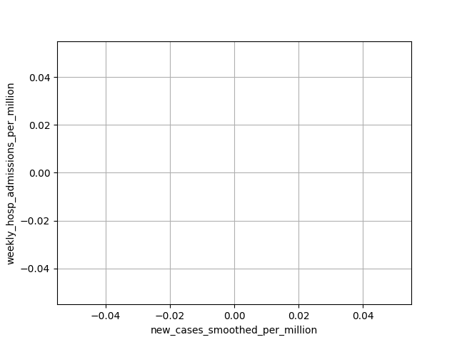
Hubungan antara kasus baru per juta dan rawat inap mingguan per juta di Indonesia.

#### UK: Kasus per Juta vs Hospitalisasi
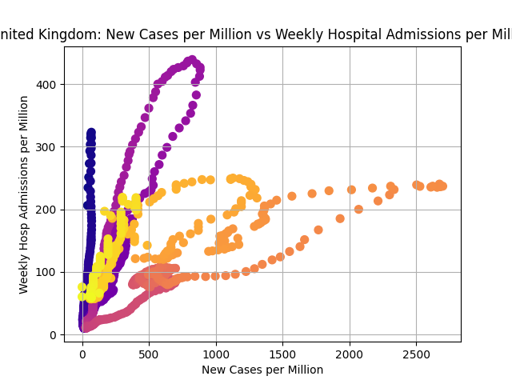
Hubungan antara kasus baru per juta dan rawat inap mingguan per juta di United Kingdom.

#### Indonesia: Vaksinasi vs Hospitalisasi
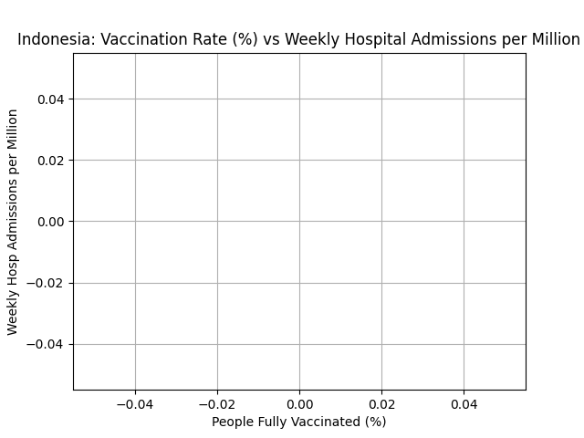
Hubungan antara persentase vaksinasi penuh dan rawat inap mingguan per juta di Indonesia.

#### UK: Vaksinasi vs Hospitalisasi
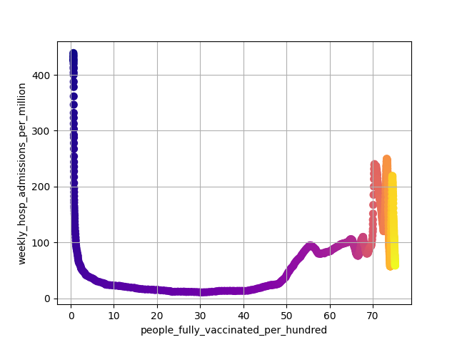
Hubungan antara persentase vaksinasi penuh dan rawat inap mingguan per juta di United Kingdom.

## Prediksi

### Prediksi Kasus per Juta dari Vaksinasi (Linear Regression)
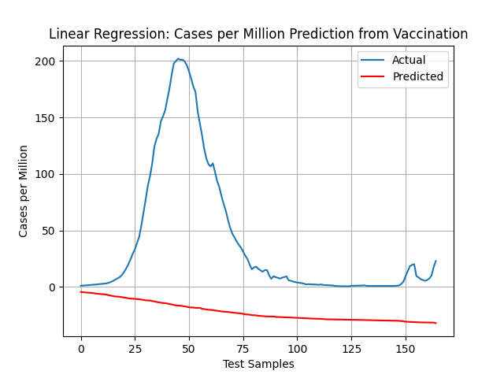
Prediksi kasus baru per juta penduduk dari persentase vaksinasi penuh menggunakan Linear Regression.

### Prediksi Kasus per Juta dari Multiple Variables (Linear Regression)
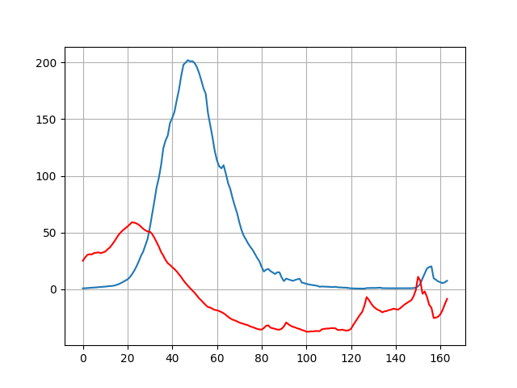
Prediksi kasus baru per juta dari reproduction_rate dan people_fully_vaccinated_per_hundred menggunakan Linear Regression.

### Prediksi Kasus per Juta dari Multiple Variables (Random Forest)
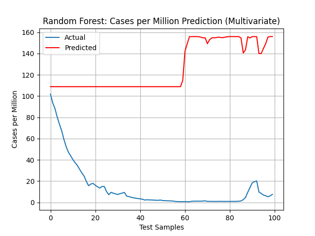
Prediksi kasus baru per juta dari reproduction_rate dan people_fully_vaccinated_per_hundred menggunakan Random Forest.

## Penjelasan R² Score

R² Score (koefisien determinasi) adalah ukuran seberapa baik model regresi cocok dengan data. Nilainya berkisar dari -∞ sampai 1:

- **1.0** = Model sempurna (menjelaskan 100% variasi data)
- **0.0** = Model tidak lebih baik dari menebak rata-rata
- **Negatif** = Model lebih buruk dari menebak rata-rata

## Hasil Prediksi

### Linear Regression untuk Kasus per Juta dari Vaksinasi:
- R² Score: -1.004 (buruk, negatif)
- Koefisien: [-1.348]
- Intercept: 52.216
- Interpretasi: Hubungan negatif lemah antara vaksinasi dan kasus per juta

### Linear Regression untuk Kasus per Juta dari Multiple Variables:
- R² Score: -0.708 (buruk, negatif)
- Koefisien: [42.746, -1.117] untuk [reproduction_rate, vaccination]
- Intercept: 9.630
- Interpretasi: Model gagal menjelaskan variasi dalam data

### Random Forest untuk Kasus per Juta dari Multiple Variables:
- R² Score: -28.864 (sangat buruk, negatif - severe overfitting)
- Interpretasi: Model Random Forest overfitting parah pada data yang terbatas

## Analisis Cross-Sectional Antar Negara

### Gambaran Umum
Analisis cross-sectional mengambil snapshot data dari tanggal tertentu (2022-05-01) dan menganalisis semua negara secara bersamaan, bukan sebagai time series.

### 3D Scatter Plot Semua Negara
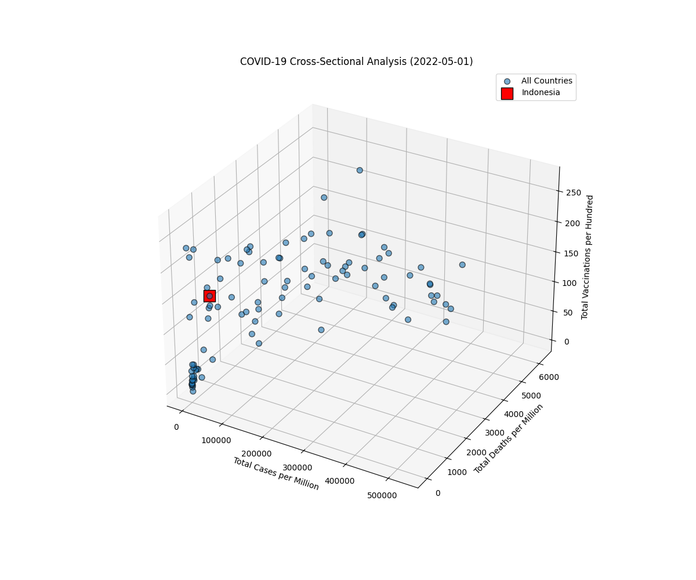
Plot 3D menampilkan hubungan antara:
- Reproduction Rate (X)
- New Cases per Million (Y)
- People Fully Vaccinated (%) (Z)

Indonesia ditandai dengan marker merah untuk perbandingan.

### Prediksi Antar Negara

#### Prediksi Kasus dari Reproduction Rate (Cross-Sectional):
- R² Score (test): 0.034
- Koefisien: 156.54
- Interpretasi: Hubungan positif lemah antara reproduction rate dan kasus baru antar negara

#### Prediksi Kasus dari Vaksinasi (Cross-Sectional):
- R² Score (test): 0.265
- Koefisien: 5.69
- Interpretasi: Vaksinasi memiliki dampak moderat terhadap penurunan kasus antar negara

#### Prediksi Multivariate (Reproduction Rate + Vaksinasi → Kasus):
- R² Score (test): 0.124
- Koefisien: [5.34, -51.53]
- Interpretasi: Model dengan dua prediktor memberikan hasil yang reasonable untuk cross-sectional

## Kesimpulan
Analisis bivariate menunjukkan pola evolusi hubungan antara variabel COVID-19 dari waktu ke waktu. Model prediksi sederhana memberikan hasil yang bervariasi, dengan performa terbaik pada prediksi kasus dari kebijakan menggunakan Linear Regression.

## File Utama
- `covid_analysis.py`: Script analisis dan prediksi
- Berbagai file PNG untuk grafik hasil analisis

## Cara Menjalankan
```bash
python3 covid_analysis.py
```

Script akan menghasilkan grafik dan output prediksi di terminal.